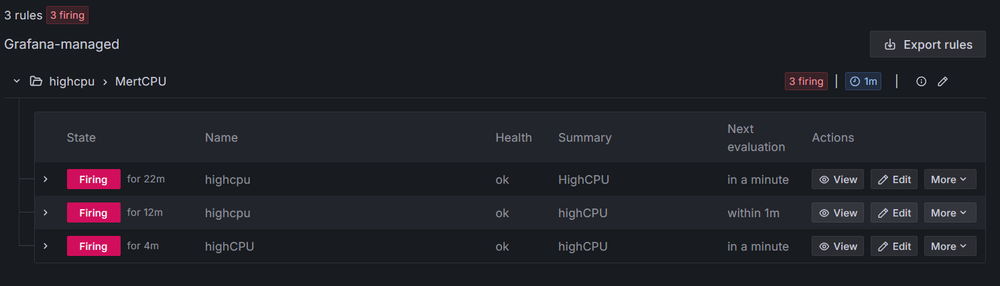
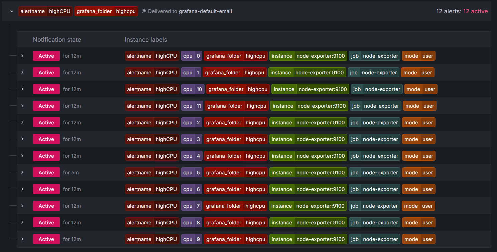

# Monitoring Sistemi

Bu projede Docker Compose kullanarak Prometheus, Grafana ve Node Exporter ile sistem kaynaklarını izleyen bir monitoring sistemi kurulmuştur.

---

## Başlatma

Terminale aşağıdaki komutu girerek projeyi başlatabilirsin:

docker compose up -d

## Grafana Giriş
Ardından tarayıcıdan Grafana arayüzüne ulaş:

🖥️ http://localhost:3000

## Giriş bilgileri:

Kullanıcı: admin

Şifre: admin

## Dashboard

Grafana açıldığında otomatik olarak bir dashboard yüklenir.
Bu dashboard Prometheus üzerinden gelen verileri kullanarak sistem metriklerini (örn. CPU kullanımı) görselleştirir

## Alert Sistemi
Grafana ile alert rules sistemini kullanarak otomatik olarak yüklenen alert kuralları içerir. Bu kurallar, önceden tanımlanmış eşiklere ulaşıldığında sizi bilgilendirmek için tasarlanmış ve projeye eklenmiştir.Alert rules bölümünden bakılabilir

Active notifications bölümünden de bakılabilir

### Alert Kuralları
Alert kuralları, `grafana/provisioning/alerting/grafana_provisioned_alerts.yaml` dosyası içinde tanımlanmıştır.

