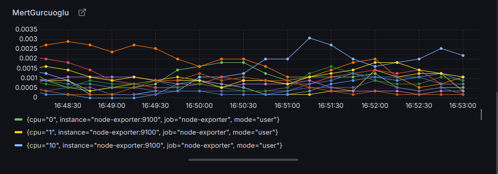

# Monitoring Sistemi

Bu projede Docker Compose kullanarak Prometheus, Grafana ve Node Exporter ile sistem kaynaklarını izleyen bir monitoring sistemi kurulmuştur.

---

## Başlatma

Terminale aşağıdaki komutu girerek projeyi başlatabilirsin:

docker compose up -d

## Prometheus Giriş
Ardından tarayıcıdan Grafana arayüzüne ulaş:

🖥️ http://localhost:3000

## Giriş bilgileri:

Kullanıcı: admin

Şifre: admin

## Dashboard

Grafana açıldığında otomatik olarak bir dashboard yüklenir.
Bu dashboard Prometheus üzerinden gelen verileri kullanarak sistem metriklerini (örn. CPU kullanımı) görselleştirir

